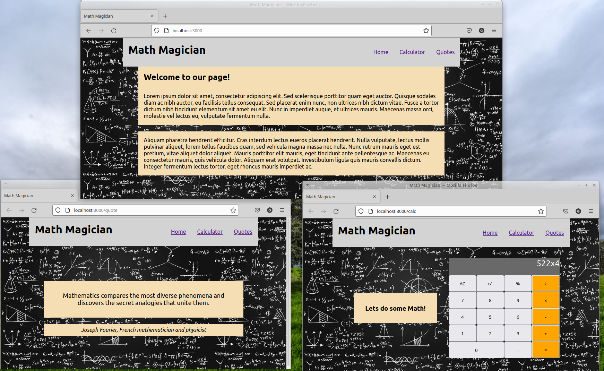

# Math Magician

This project is about a 3 page website using REACT router. The home page has a couple of fixed paragraphs, the calc page has a simple calculator and the quotes page selects a random quote out of a pool quotes.

## Screenshot

## Built With

- HTML
- CSS
- JavaScript
- NPM
- React
- React router

## Requisites
node v16.13
npm v8.3

## Installation

Clone the repository: 

`git clone https://github.com/gdumani/math-magician.git`
`cd math-magician`

Load required npm software

`npm install`

## Available Scripts

In the project directory, you can run:

`npm start`

Runs the app in the development mode.\
Open [http://localhost:3000](http://localhost:3000) to view it in your browser.

The page will reload when you make changes.\
You may also see any lint errors in the console.

`npm test`

Launches the test runner in the interactive watch mode.\
See the section about [running tests](https://facebook.github.io/create-react-app/docs/running-tests) for more information.

`npm run build`

Builds the app for production to the `build` folder.\
It correctly bundles React in production mode and optimizes the build for the best performance.

The build is minified and the filenames include the hashes.\
Your app is ready to be deployed!

## Authors

**Giancarlo Dumani**

- GitHub: [@gdumani](https://github.com/gdumani)
- Twitter: [@gdumani1](https://twitter.com/gdumani1)
- LinkedIn: [ Giancarlo-Dumani](https://www.linkedin.com/in/gdumani/?originalSubdomain=cr)

## 🤝 Contributing

Contributions, issues, and feature requests are welcome!

Feel free to check the [issues page](../../issues/).

## Show your support

Give a ⭐️ if you like this project!

## Acknowledgments

- Hat tip to anyone whose code was used
- Inspiration
- etc

## 📝 License

This project is [MIT](./MIT.md) licensed.
